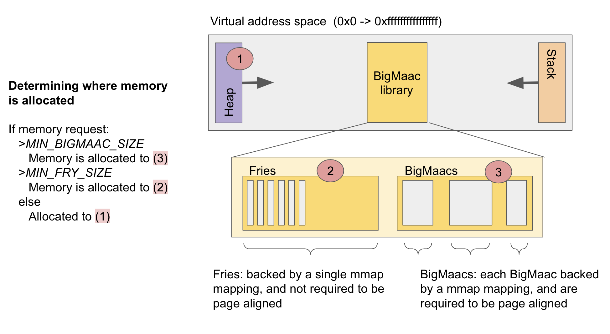

# BigMaac 🍔 🍟 ( Big Malloc Access And Calloc )

## because sometimes a happy meal is not big enough

BigMaac can be used in userspace (e.g. inside Kubernetes containers) to enable selective user space swap for large (user defined) memory allocations (typically your data objects).

BigMaac intercepts calls to memory management that would normally get mapped directly to the heap/RAM and instead returns memory allocated from an alternative source (SSD/Disk).



The specific calls BigMaac intercepts are, 

`malloc()`, `calloc()`, `realloc()` and `free()`

If any of these calls are managing memory smaller than `BIGMAAC_MIN_BIGMAAC_SIZE` (env variable), BigMaac passes them directly through to the original memory management system. However if a memory call exceeds this size, it is no longer a small fry but instead it is a bigmaac, and therefore instead of using RAM directly it uses the Disk backed RAM storage through the magic of `mmap()`. 


```
If memory_request > BIGMAAC_MIN_BIGMAAC_SIZE -> its a 🍔 , so swap to disk if need be
  else memory request gets sent to normal memory management system (RAM)
```

For example, lets say you are on a system that has no swap available and only 2GB RAM, but! you would like to work with matricies of size 5GB. BigMaac lets you do that!
When numpy/python/anything makes the request for 5GB of memory, that call is intercepted and diverted by BigMaac. It is diverted through mmap to Disk backed RAM. Which means that the OS will keep whatever part of the 5GB matrix in can in RAM, and page the rest from disk. If you happen to run the same code on a system with 10GB RAM, it ~should leave the entire contents in RAM, with hopefully not much slowdown.

# BigMaac quick start
To use BigMaac, 

`make`

And then ,
 
`LD_PRELOAD=./bigmaac.so your-executable with all the arguments`

For example,

`LD_PRELOAD=./bigmaac.so python test.py`

To run test cases (generate checksums with and without library usage), 
`make test`

# But I want fries with that!
Memory requests larger than `BIGMAAC_MIN_BIGMAAC_SIZE` are swapped using mmap with each memory request being backed by a separate file on the swap partition. In order for these to be valid (efficient) mmap mappings memory requests are aligned to a multiple of page size (often 4096bytes) which makes this method of swapping inefficient for smaller (small fries) memory allocations. To handle small fries (<<page_size) a new level of paging is used.


```
If memory_request > BIGMAAC_MIN_BIGMAAC_SIZE -> its a 🍔 , so swap to disk if need be (using mmap with unique file and page size aligned memory)
Else if memory_request > BIGMAAC_MIN_FRY_SIZE -> its a 🍟 , so swap to disk if need be  (using mmap with a singe file for all fries)
  else memory request gets sent to normal memory management system (RAM)
```

BIGMAACS are sent to a preallocated 512GB (env variable `SIZE_BIGMAAC`) virtual address space, each BIGMAAC is backed by its own file on the swap partition [ page aligned ]

FRIES are sent to a preallocated 512GB (env variable `SIZE_FRIES`) virtual address space, the total of which is backed by its own single file on the swap partition.

For example if you would like to swap all memory allocations above 10MB using BigMaac and all memory allocations above 128bytes using FRIES you would run the following, 

`LD_PRELOAD=./bigmaac.so BIGMAAC_MIN_BIGMAAC_SIZE=10485760 BIGMAAC_MIN_FRY_SIZE=128 your-executable with all the arguments`

The above command will swap all memory allocations larger than 128 bytes, if the allocation is larger than 10MB it will be swapped to its own virtual file on the swap partition. For memory allocations smaller than or equal to 128 bytes the system memory functions are directly called.

# Choosing the swap partition 
By default `/tmp/` is used for swapping memory to disk. If you would like to use a different swap partition you need to change the enviornment variable,

`LD_PRELOAD=./bigmaac.so BIGMAAC_TEMPLATE=/swap-partition/bigmaax.XXXXXXXX your-executable with all the arguments`

Once a temporary file is opened, it is immediately removed from disk and only the file description remains open in the process running wrapped by BIGMAAC. Once the process dies, the kernel removes the swap files. This gaurantees that no swap files are left behind after the application is done.

# How efficient is this?
The main focus of BigMaac is to swap larger memory calls, things like large data matricies that dont always behave as random access and are variable from run to run. To avoid adding overhead to smaller memory calls, all of BIGMAAC and FRIES are kept in a contiguous 1TB (512GB BIGMAAC `env SIZE_BIGMAAC` / 512GB FRIES `env SIZE_FRIES`) part of the virtual address space. This allows a simple two pointer comparison to determine if a memory allocation is managed by BIGMAAC or the system library, hopefully adding very minimal overhead to calls that pass through.

